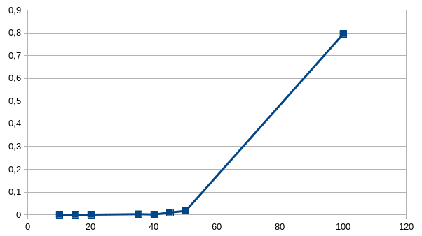
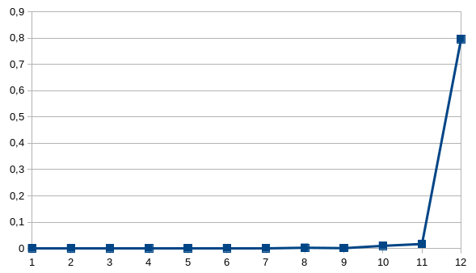
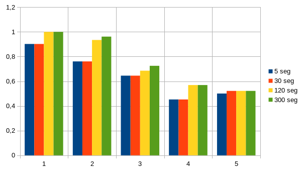
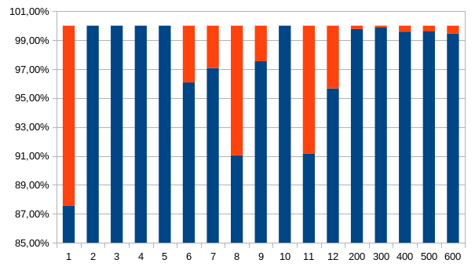
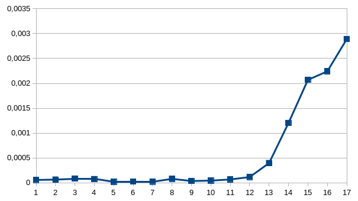

<h1> Problema da Mochila Relacional</h1>
<h2> André Almeida <i>164047</i>
 MC658 - Lab 02</h2>

## O problema
A entrada do problema é dada por:
- Número de itens;
- Matriz de relações de itens;
- Vetor de valor de itens;
- Vetor de peso de itens;
- A capacidade da mochila e
- O tempo máximo disponível para o cálculo da solução

Todos os resultados mostrandos foram executados em uma máquina com processador Intel Core i7-3537U CPU @ 2.00GHz.

## Algoritmo exato

A abordagem exata para o problema foi criar uma estrutura de solução global, com a soma dos itens e um vetor de índices de itens da solução. Esta estrutura é atualizada sempre que é encontrada uma solução melhor.

O algoritmo cria uma árvore de combinações de índices para cada item da entrada. As combinações geradas por cada nó inserem somente índices que sejam maiores que o último índice do nó pai, de forma a evitar permutações. Por exemplo, seja $n$ o número de itens e dado um nó com índices, $ i_1, i_2, i_3, ...,i_j$ , onde $i_k < i_{k+1}$, esse nó gerará $n-j$ folhas. Para cada $m \in [j+1, n]$, o nó ira uma folha inserindo em cada folha os índices do nó pai ($ i_1, i_2, i_3, ...,i_j$) mais o índice $m$.

Se os itens de um nó não cabem na mochila, esse nó vira uma folha e não gera mais combinações. Por exemplo, se um conjunto de itens $(i_1, i_3, i_7)$ já ocupa a capacidade máxima da mochila, nenhum item $i_k$ (já que o peso de $i_k$ é maior que 0) será capaz de ocupar a mochila e não faz sentido calcularmos soluções com o conjunto inicial.

Agora, dada uma raíz (que pela definição anterior possúi apenas um item), verificamos se este item cabe na mochila e, se cabe, chamamos uma rotina para calcular os valores de seus nós-filhos. Essa rotina passa por parâmetro o valor do item e a capacidade total da mala subtraída do peso do item. Para cada filho que couber na mala, é calculada a soma dos itens selecionados (levando em conta a soma das relações entre os itens) e é feita uma chamada recursiva passando a soma atual e reduzindo a capacidade da mala com o peso do novo item.

<!-- O algoritmo irá criar uma árvore de combinações para cada índice de item $i$, com apenas o índice $i$ na raíz. Cada nó desta árvore vai gerar $k$ nós diretos, onde $k = n - m$, $n$ é o número total de itens e $m$ é o índice do último elemento do nó. Para cada $u \in [m+1, n]$, a árvore terá um nó formado por $S' + u$, onde $S'$ é o conjunto de índices do seu nó pai.

 A cada nível da árvore, um item é adicionado em cada nó. Os nós do nível 2 tem dois itens, o 3, 3 itens, e assim por diante. Para evitar repetições de combinações, um item é adicionado em um nó somente se o índice dele for maior

 Dado uma tentativa de solução $S'$, $ \forall$ $k \in [u+1, n]$, onde $u$ é índice do último item em $S'$:
 - Se o peso $p_k \leq C-\sum\limits_{i \in S'}{p_i}$ e $\sum\limits_{i \in S'}\sum\limits_{j \in S'}{r_{ij}}+\sum\limits_{i \in S'}{v_i}+v_k>$ -->

<!-- No primeiro passo chamamos uma rotina para inserir itens um por um na solução, verificando se gera uma solução melhor e, se ainda houver espaço na mochila, chama a rotina recursivamente para inserir mais um elemento. Quando não há mais espaço não chamamos a rotina, e desta forma cortamos caminhos que não seriam frutíferos. Por exemplo, se um conjunto de itens `[a, b, c]` já ocupa a capacidade máxima da mochila, nenhum item será capaz de ocupar a mochila e não faz sentido calcularmos soluções com o conjunto inicial `[a, b, c]`. O algoritmo não gera combinações repetidas nem permutações, porque sempre que for inserir um índice de item, seleciona um de índice maior que o seu.  -->

Por exemplo, para uma entrada com 4 itens, o algoritmo irá gerar a seguinte árvore de combinações:

### Implementação
A implementação do algoritmo é feita da seguinte maneira, começando pela rotina principal:
> _1._ Iniciar o alarme com o tempo máximo e ordenar decrescentemente os `n` itens pelo seu _valor relativo¹_.
  _2._ Criar uma estrutura global `solução`, com a soma igual à 0 e o conjunto de itens vazio
  _3._ Chamar a rotina `calculaSolução(items, valores, pesos, relações, capacidade)`
  _4._ Quando a rotina acabar ou quando o alarme acabar, retorna o conjunto de items e a soma da solução atual

¹O _valor relativo_ é calculado fazendo a soma do valor de um item mais todas os valores de suas relações e dividindo pelo seu peso:
> valor_relativo = (somaTodasRelações(item) + valor[item]) / peso[item]

Usamos um vetor ordenado para, no caso em que o tempo estourar, ter uma chance que tenhamos começado por um item que venham a ter soluções mais próximas da ótima.

A rotina `calculaSolução(...)` por sua vez é definida por:

> _1._ Para cada índice `i` no vetor ordenado:
  _2._ &nbsp; &nbsp;  Verificar se o item cabe na mochila e, se couber:
  _3._ &nbsp; &nbsp; &nbsp; &nbsp; Cria uma solução com apenas este elemento e compara com a solução global. Se for melhor, substituiu ela.
  _4._ &nbsp; &nbsp; &nbsp; &nbsp; Se ainda houver espaço na mochila, chama a rotina `calculaFilhos([i], valor[i], capacidade - v[i])`

Nessa rotina `calculaSolução(...)` criamos soluções com apenas um item e, caso ainda exista espaço disponível, chamamos uma subrotina para verificar as combinações que são "filhas" desta rotina, de forma a percorrer todas as combinações que são válidas. Para cada `i`, passamos o `valor[i]` como uma soma parcial e reduzimos a capacidade da mochila subtraindo o peso de `i`. A rotina `calculaFilhos(itens[], soma_parcial, capacidade)`  funciona de maneira semelhante, mas sem a etapa de buscar os itens ordenados de forma a evitar consultas a vetor que iriam pesar no desempenho do algoritmo.

Rotina `calculaFilhos(itens[], soma_parcial, capacidade_parcial)`:
> _1._ Para `j`, começando no último índice de `itens[] + 1` até `número total de itens`:
  _2._ &nbsp; &nbsp; Se o alarme esgotou, retornamos a solução global do momento
  _3._ &nbsp; &nbsp; Se o `peso[j]` cabe na mochila:
  _4._ &nbsp; &nbsp; &nbsp; &nbsp; Adiciona o `j` no vetor `itens`
  _5._ &nbsp; &nbsp; &nbsp; &nbsp; Calculamos a `soma_atual`, somando a `soma_parcial` + `valor[j]` + `valorRelacoes(j, itens)`
  _6._ &nbsp; &nbsp; &nbsp; &nbsp; Se esta soma for maior do que a solução global, substituiu a global por ela
  _7._ &nbsp; &nbsp; &nbsp; &nbsp; Se ainda existe espaço na mochila:
  _8._ &nbsp; &nbsp; &nbsp; &nbsp; &nbsp; &nbsp; Chamamos `calculaFilhos(itens[], soma_atual, capacidade - peso[j])`
  _9._ &nbsp; &nbsp; &nbsp; &nbsp; Retiramos `j` do vetor `itens`

O cálculo na linha _5_ de `valorRelacoes()` é feito tomando cuidado para não somar duas vezes a mesma relação. Somamos apenas as relações na coluna da matriz do item novo, pegando os itens que já estão na mocilha. Como a coluna do item novo nunca foi percorrida antes, os itens que iremos somar não serão repetidos.

### Resultados

#### Casos pequenos
Para os casos de teste de 01 à 12, o algoritmo exato executou abaixo de um segundo e obteve a resposta esperada. O tempo de execução do algoritmo crescia exponencialmente conforme o número de itens da entrada, como é possível ver nos gráficos abaixo:

  

<i> Número de itens x Tempo de execução </i>

 

  

<i> Caso teste x Tempo de execução </i>

#### Casos grandes
Para os casos grandes, o algoritmo não conseguia ser executado em tempo hábil. Foram testados vários tempos de corte para o algoritmo. Conforme aumenta o tamanho da entrada, a influência de cada segundo diminui para a aproximação do resultado exato, mostrando o caráter exponencial do algoritmo.

  

<i> Grupos de caso teste x Precisão </i>

 

Precisão é o valor obtido dividido pelo valor esperado, variando de 0 à 1.

## Algoritmo aproximado

O algoritmo aproximado ordena decrescentemente os itens pelo valor relativo, definido na seção II.:

> valor_relativo = (somaTodasRelações(item) + valor[item]) / peso[item]

Após a ordenação, ele insere o maior item não inserido que cabe na mochila até que ela esteja cheia e toma estes itens como a solução. Essa heurística foi escolhida porque privilegia os itens com maior potencial para contribuirem com uma soma de valores próxima da ótima. A divisão pelo peso garante que o valor relativo cresça conforme o quanto da mochila que irá ocupar.

### Implementação
A implementação do algoritmo heurístico é dada por:

> _01._ Inicia o alarme com o tempo máximo e ordena decrescentemente o vetor `itens` com os `n` itens pelo seu _valor relativo¹_
  _02._ Inicializa `soma` como 0
  _04._ Inicializa `capacidade_parcial` com o valor da `capacidade`
  _05._ Inicializa `solucao` como um vetor vazio
  _06._ Para `ì`, de `0` até `n`:
  _07._ &nbsp; &nbsp; Se o alarme acabou, retorna a soma e solução atual
  _08._ &nbsp; &nbsp; Se `peso[i] <= capacidade_parcial`:
  _09._ &nbsp; &nbsp; &nbsp; &nbsp; Coloca `i` em `solucao`
  _10._ &nbsp; &nbsp; &nbsp; &nbsp; Adiciona `valor[i]` em `soma`
  _11._ &nbsp; &nbsp; &nbsp; &nbsp; Adiciona `valorRelacoes(i, solucao)` em `soma`
  _12._ &nbsp; &nbsp; &nbsp; &nbsp; Subtrai `peso[i]` de `capacidade`
  _13._ Retorna `soma` e `solucao`

### Resultados
Todas as entradas tiveram tempo de execução muito similar, atingindo um pico em 0,003 segundos no maior caso de teste. A precisão das respostas mostrou evoluir de maneira proporcional ao tamanho da entrada. Todos os casos testes grandes obtiveram 99% de precisão, e alguns pequenos atingiram 100%. Devido a complexidade das relações no problema, é improvável que entradas muito grandes atinjam 100%.

  

<i> Caso teste x Precisão </i>

 

  

<i> Casos teste x Tempo de execução </i>

 

## Conclusão
Para entradas pequenas, vale a pena executar os algoritmos exatos, já que estes apresentam resultados 100% precisos em tempo suficientemente pequenos, enquanto o heurístico, apesar de apresentar tempo menor, não garante precisão de 100% em todos os casos. Para as entragas grandes a escolha é usar o algoritmo aproximado, já que em pouquissimo tempo consegue retornar resultados com 99% de precisão, enquanto o algoritmo exato, mesmo com $10^6$ mais tempo não conseguiu alcançar 50% de precisão para algumas entradas.
